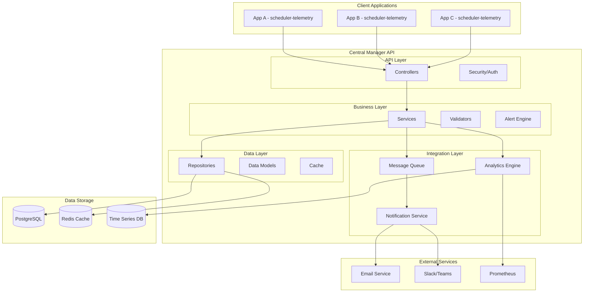
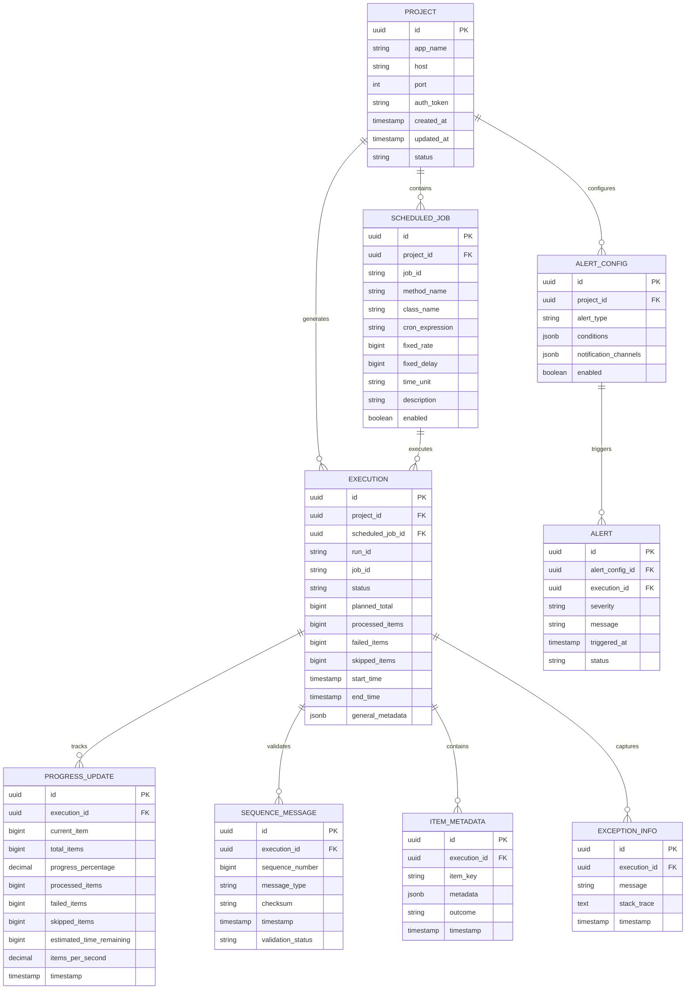

# Central Manager API - Arquitetura e Design

## 📚 **Resumo/Objetivo**

A **Central Manager API** é uma aplicação Spring Boot que atua como centro de controle e monitoramento para aplicações que utilizam a biblioteca `scheduler-telemetry`. Esta API recebe, processa e armazena dados de telemetria em tempo real, fornecendo dashboards de monitoramento, sistema de alertas e analytics para jobs agendados distribuídos.

## 🎯 **Contexto**

### Motivação
Com a implementação da biblioteca `scheduler-telemetry`, múltiplas aplicações Spring Boot agora enviam dados de telemetria sobre seus jobs agendados. Para centralizar e gerenciar essas informações, é necessário uma API que:

- **Consolide dados** de múltiplas aplicações em um local central
- **Forneça visibilidade** em tempo real sobre o status dos jobs
- **Detecte problemas** proativamente através de alertas e notificações
- **Permita análise** histórica e tendências de performance
- **Gerencie o ciclo de vida** das aplicações registradas

### Cenário de Uso
```
┌─────────────────┐    ┌─────────────────┐    ┌─────────────────┐
│   App A         │    │   App B         │    │   App C         │
│   (Prod)        │    │   (Staging)     │    │   (Dev)         │
│                 │    │                 │    │                 │
│ @MonitoredScheduled │ │ @MonitoredScheduled │ │ @MonitoredScheduled │
│ @Scheduled      │    │ @Scheduled      │    │ @Scheduled      │
└─────────┬───────┘    └─────────┬───────┘    └─────────┬───────┘
          │                       │                       │
          │                       │                       │
          └───────────────────────┼───────────────────────┘
                                  │
                                  ▼
                    ┌─────────────────────────────┐
                    │     Central Manager API     │
                    │                             │
                    │ • Recebe telemetria        │
                    │ • Armazena dados           │
                    │ • Dashboard em tempo real  │
                    │ • Sistema de alertas       │
                    │ • Analytics e relatórios   │
                    └─────────────────────────────┘
                                  │
                                  ▼
                    ┌─────────────────────────────┐
                    │      Dashboard Web          │
                    │                             │
                    │ • Monitoramento visual     │
                    │ • Gráficos de progresso    │
                    │ • Alertas e notificações   │
                    │ • Configurações            │
                    └─────────────────────────────┘
```

## 🏗️ **Arquitetura**

### Visão Geral da Arquitetura



### Componentes Principais

#### 1. **API Layer (Controllers)**
- **ProjectController**: Gerencia registro de aplicações
- **ExecutionController**: Processa relatórios de execução
- **ProgressController**: Atualizações de progresso em tempo real
- **SequenceController**: Validação de sequência e sincronização
- **StatusController**: Consulta de status e histórico

#### 2. **Business Layer (Services)**
- **ProjectService**: Lógica de negócio para aplicações
- **ExecutionService**: Processamento de execuções
- **ProgressService**: Gerenciamento de progresso
- **SequenceService**: Validação de sequência e checksums
- **AlertService**: Sistema de alertas e notificações
- **AnalyticsService**: Análise de dados e relatórios

#### 3. **Data Layer**
- **ProjectRepository**: Gerenciamento de aplicações registradas
- **ExecutionRepository**: Armazenamento de execuções
- **ProgressRepository**: Histórico de progresso
- **SequenceRepository**: Controle de sequência
- **AlertRepository**: Configurações e histórico de alertas

#### 4. **Integration Layer**
- **MessageQueue**: Processamento assíncrono de mensagens
- **NotificationService**: Envio de notificações (email, Slack, etc.)
- **AnalyticsEngine**: Processamento de métricas e tendências
- **CacheService**: Cache Redis para performance

### Modelo de Dados

#### Entidades Principais



## 🔌 **APIs e Endpoints**

### 1. **Registro de Aplicações**
```http
POST /api/projects/register
Content-Type: application/json
Authorization: Bearer {token}

{
  "appName": "user-service",
  "host": "user-service.prod.example.com",
  "port": 8080,
  "scheduledJobs": [
    {
      "jobId": "user-cleanup",
      "methodName": "cleanupInactiveUsers",
      "className": "com.example.UserCleanupScheduler",
      "cronExpression": "0 0 2 * * ?",
      "description": "Limpeza diária de usuários inativos"
    }
  ]
}
```

### 2. **Relatório de Execução**
```http
POST /api/executions/report
Content-Type: application/json
Authorization: Bearer {token}

{
  "jobId": "user-cleanup",
  "runId": "550e8400-e29b-41d4-a716-446655440000",
  "status": "SUCCESS",
  "processedItems": 1250,
  "failedItems": 0,
  "skippedItems": 50,
  "startTime": "2024-08-19T02:00:00Z",
  "endTime": "2024-08-19T02:15:30Z",
  "generalMetadata": {
    "environment": "production",
    "batch_size": 1250,
    "cleanup_threshold_days": 90
  }
}
```

### 3. **Atualização de Progresso**
```http
POST /api/executions/progress
Content-Type: application/json
Authorization: Bearer {token}

{
  "jobId": "user-cleanup",
  "runId": "550e8400-e29b-41d4-a716-446655440000",
  "currentItem": 750,
  "totalItems": 1250,
  "progressPercentage": 60.0,
  "processedItems": 750,
  "failedItems": 0,
  "skippedItems": 25,
  "estimatedTimeRemaining": 900000,
  "itemsPerSecond": 8.33
}
```

### 4. **Validação de Sequência**
```http
POST /api/executions/sequence
Content-Type: application/json
Authorization: Bearer {token}

{
  "runId": "550e8400-e29b-41d4-a716-446655440000",
  "sequenceNumber": 1,
  "messageType": "PROGRESS",
  "checksum": "a1b2c3d4e5f6...",
  "timestamp": "2024-08-19T02:05:00Z"
}
```

## 🔒 **Segurança e Autenticação**

### Estratégia de Autenticação
- **API Key Authentication**: Cada aplicação recebe um token único
- **JWT Tokens**: Para usuários administrativos do dashboard
- **Rate Limiting**: Proteção contra abuso da API
- **CORS Configuration**: Controle de origens permitidas

### Controle de Acesso
```yaml
security:
  api-key:
    header: X-API-Key
    required: true
  
  jwt:
    secret: ${JWT_SECRET}
    expiration: 24h
  
  roles:
    - ROLE_APP_CLIENT    # Aplicações que enviam telemetria
    - ROLE_VIEWER        # Usuários que visualizam dados
    - ROLE_ADMIN         # Administradores do sistema
    - ROLE_OPERATOR      # Operadores que configuram alertas
```

## 📊 **Monitoramento e Observabilidade**

### Métricas da API
- **Throughput**: Mensagens por segundo recebidas
- **Latência**: Tempo de resposta por endpoint
- **Erro Rate**: Taxa de erros por tipo
- **Queue Depth**: Tamanho das filas de processamento
- **Database Performance**: Tempo de queries e conexões

### Logs Estruturados
```json
{
  "timestamp": "2024-08-19T02:00:00Z",
  "level": "INFO",
  "logger": "com.schedkiwi.centralmanager.api.ExecutionController",
  "message": "Execution report received",
  "traceId": "abc123def456",
  "spanId": "xyz789",
  "executionId": "550e8400-e29b-41d4-a716-446655440000",
  "jobId": "user-cleanup",
  "appName": "user-service",
  "processingTimeMs": 45
}
```

### Health Checks
- **Database Connectivity**: Verificação de conexão com banco
- **Cache Health**: Status do Redis
- **External Services**: Disponibilidade de serviços externos
- **Queue Health**: Status das filas de mensagens

## 🚀 **Escalabilidade e Performance**

### Estratégias de Escalabilidade
- **Horizontal Scaling**: Múltiplas instâncias da API
- **Load Balancing**: Distribuição de carga
- **Database Sharding**: Particionamento por aplicação ou período
- **Caching Strategy**: Cache em múltiplas camadas

### Otimizações de Performance
- **Async Processing**: Processamento assíncrono de mensagens
- **Batch Operations**: Operações em lote no banco
- **Connection Pooling**: Pool de conexões otimizado
- **Indexing Strategy**: Índices otimizados para consultas frequentes

### Configurações de Performance
```yaml
performance:
  async:
    core-pool-size: 10
    max-pool-size: 50
    queue-capacity: 1000
  
  database:
    connection-pool-size: 20
    batch-size: 100
    query-timeout: 30s
  
  cache:
    ttl: 300s
    max-size: 10000
    eviction-policy: LRU
```

## 🧪 **Testes e Qualidade**

### Estratégia de Testes
- **Unit Tests**: Cobertura > 90% para serviços e validadores
- **Integration Tests**: Testes com banco de dados real
- **Contract Tests**: Validação de contratos de API
- **Performance Tests**: Testes de carga e stress
- **E2E Tests**: Testes com aplicações clientes reais

### Testes de Integração
```kotlin
@SpringBootTest
@AutoConfigureTestDatabase
class ExecutionControllerIntegrationTest {
    
    @Test
    fun `deve processar relatório de execução com sucesso`() {
        // Given
        val executionReport = createExecutionReport()
        
        // When
        val response = restTemplate.postForEntity(
            "/api/executions/report",
            executionReport,
            ExecutionResponse::class.java
        )
        
        // Then
        assertThat(response.statusCode).isEqualTo(HttpStatus.OK)
        assertThat(response.body?.status).isEqualTo("RECEIVED")
    }
}
```

## 📋 **Roadmap de Implementação**

### Fase 1: Core API (2-3 semanas)
- [ ] Estrutura do projeto e configurações básicas
- [ ] Modelos de dados e repositórios
- [ ] Controllers para endpoints principais
- [ ] Sistema de autenticação básico
- [ ] Testes unitários e de integração

### Fase 2: Dashboard e UI (2-3 semanas)
- [ ] Interface web para monitoramento
- [ ] Gráficos de progresso em tempo real
- [ ] Visualização de jobs e execuções
- [ ] Sistema de navegação e busca

### Fase 3: Sistema de Alertas (1-2 semanas)
- [ ] Engine de regras de alerta
- [ ] Sistema de notificações
- [ ] Configuração de alertas por aplicação
- [ ] Dashboard de alertas

### Fase 4: Analytics e Relatórios (1-2 semanas)
- [ ] Engine de analytics
- [ ] Relatórios de performance
- [ ] Métricas e tendências
- [ ] Exportação de dados

### Fase 5: Produção e Deploy (1 semana)
- [ ] Configurações de produção
- [ ] Monitoramento e alertas
- [ ] Documentação de deploy
- [ ] Treinamento da equipe

## 🔗 **Referências**

- [Biblioteca Scheduler Telemetry](../scheduler-telemetry/README.md)
- [API Reference da Biblioteca](../scheduler-telemetry/docs/api-reference.md)
- [Exemplos de Uso](../scheduler-telemetry/docs/examples.md)
- [Spring Boot Documentation](https://spring.io/projects/spring-boot)
- [PostgreSQL Documentation](https://www.postgresql.org/docs/)
- [Redis Documentation](https://redis.io/documentation)

---

**Histórico de Alterações**
- **2024-08-19**: Criação inicial da documentação de arquitetura
